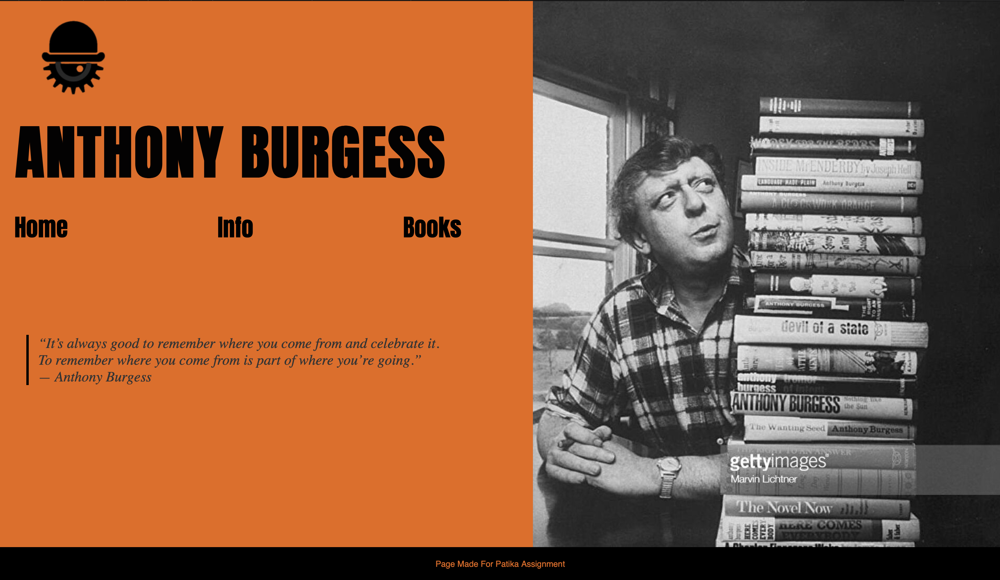
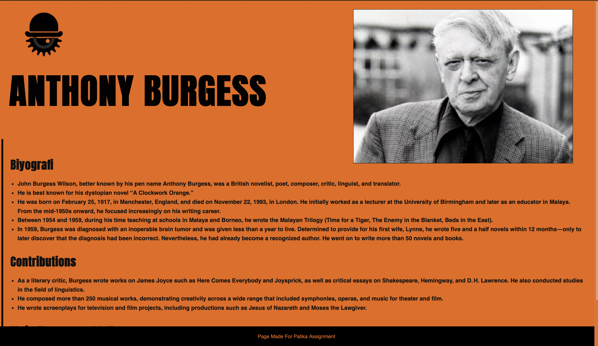
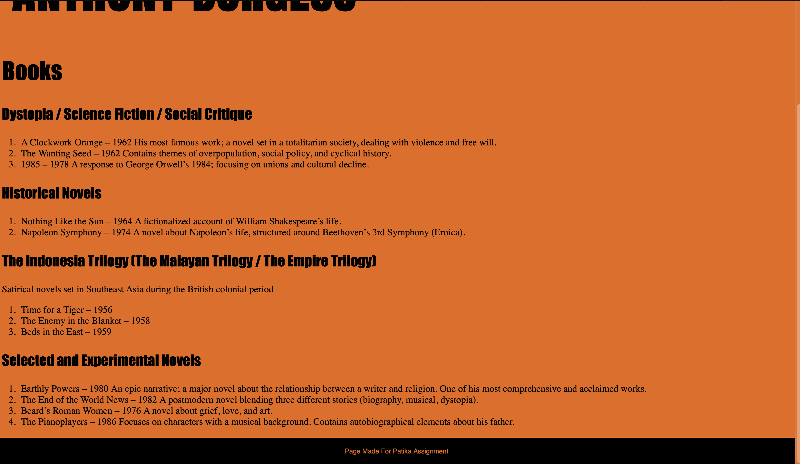

# Anthony Burgess Tribute Website

This is a simple and elegant tribute website created to honor the life and works of **Anthony Burgess**, the renowned British novelist, composer, and critic. The site is built using only HTML and CSS.

## 📁 Project Structure
project-folder/
│
├── index.html         # Homepage with header, quote, and navigation
├── info.html          # Biographical details and contributions
├── books.html         # List of Anthony Burgess’s key works
├── style.css          # Main stylesheet for layout and design
└── images/
├── logo.png       # Site logo
├── kapak.jpg      # Cover/header image
└── detay.webp     # Biographical section image

## Preview

Site ana sayfasının görünümü yukarıdaki gibidir.

## 🚀 Features

- **Responsive Layout** (partially): Custom navigation and layout using Flexbox  
- **Custom Fonts** via Google Fonts (`Anton`)
- **Animated Header** for smooth intro text
- **Hover Effects** on navbar links
- **Organized Book Listing** by category (Dystopia, Historical, Trilogy, etc.)
- **Highlighted Quote** from Anthony Burgess
- **Well-structured Biographical Section**

## 🛠️ Technologies Used

- HTML5
- CSS3 (Flexbox, Animations, Pseudo-elements)
- Google Fonts

## 📚 Pages Overview

- **index.html** – Home page with header, navigation bar, and a quote
- **info.html** – Biography, major contributions, and themes of Burgess
- **books.html** – Categorized book list with brief descriptions

## 📷 Image Credits

All images (`logo.png`, `kapak.jpg`, `detay.webp`) are assumed to be either:
- Royalty-free
- Created by the developer
- Or used under fair use for educational/demo purposes

(Please make sure image use complies with copyright if published.)

## 📄 License

This project is for educational and non-commercial use.  
If you'd like to contribute or reuse it, feel free to fork the repository and give credit.

---

